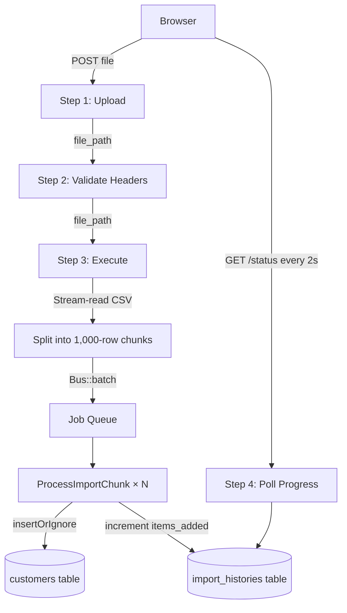

# Bulk Data Import System

A Laravel 12 web application for importing large CSV files into a database using a guided 4-step wizard, background job batching, and real-time progress monitoring.

---

## Overview

```
Upload CSV → Validate Headers → Execute Import → Monitor Progress
```

Files are processed in **1,000-row chunks**, each dispatched as an independent background job via Laravel's `Bus::batch()`. The UI polls for live progress every 2 seconds without blocking the browser.

---

## Features

- **4-step guided UI** — Upload, Validate, Execute, Monitor
- **Streaming file upload** — 100 MB cap, stored to local disk before processing
- **Header validation** — checks for required columns before any data is written
- **Chunked batch processing** — 1,000 rows per job, fully parallelisable
- **File-based chunking** — chunk data written to disk as JSON, not held in memory; supports files with millions of rows without exhausting PHP memory
- **Zero disk residue** — uploaded file deleted immediately after chunking; chunk files deleted after each job completes
- **Duplicate handling** — `insertOrIgnore` silently skips duplicate emails
- **Real-time progress polling** — live percentage, row count, job status
- **Import history** — every run is recorded with file name, status, and rows inserted
- **Fault tolerant** — failed chunks are retried up to 3 times; one bad chunk does not cancel the rest
- **Client-side file validation** — rejects files over 40 MB before upload begins
- **Sample CSV generator** — browser download or Artisan command, up to 1 million rows

---

## Tech Stack

| Layer | Technology |
|---|---|
| Framework | Laravel 12 (PHP 8.2) |
| Database | SQLite (swappable to MySQL / PostgreSQL) |
| Queue | Laravel Job Batching (`database` driver) |
| Frontend | Blade + Tailwind CSS (CDN) |
| Background jobs | `ProcessImportChunk` — reads chunk JSON from disk, bulk inserts, deletes file |

---

## Requirements

- PHP 8.2+
- Composer
- SQLite (bundled with PHP) **or** MySQL / PostgreSQL

---

## Installation

```bash
# 1. Clone the repository
git clone https://github.com/TWFILM/Bulk-Data-Import-System.git
cd Dulk-Data-Import-System

# 2. Install PHP dependencies
composer install

# 3. Create the environment file and generate an app key
cp .env.example .env
php artisan key:generate

# 4. Run database migrations
php artisan migrate

# 5. Start the development server
php artisan serve
```

Open **http://localhost:8000** in your browser.

> **Important:** The import UI requires a queue worker running in a separate terminal (see below).

---

## Running the Queue Worker

Jobs are dispatched to the `database` queue. Start the worker in a second terminal:

```bash
php artisan queue:work --tries=3 --timeout=120
```

Keep this process running while you test imports. Without it, dispatched jobs will sit pending and progress will remain at 0%.

---

## Database Schema

### `customers`

| Column | Type | Notes |
|---|---|---|
| `id` | bigint PK | Auto-increment |
| `name` | string | |
| `email` | string UNIQUE | Duplicate emails are skipped on import |
| `phone` | string nullable | |
| `company` | string nullable | |
| `address` | string nullable | |
| `import_batch_id` | string (FK) | Links back to the import run |
| `created_at / updated_at` | timestamp | |

### `import_histories`

| Column | Type | Notes |
|---|---|---|
| `id` | string PK | Laravel Batch UUID |
| `file_name` | string | Original uploaded filename |
| `status` | string | `Processing` · `Finished` · `Failed` |
| `items_added` | integer | Rows successfully inserted |
| `created_at / updated_at` | timestamp | |

---

## API Routes

| Method | URI | Description |
|---|---|---|
| `GET` | `/` | Import wizard UI |
| `POST` | `/import/upload` | Upload CSV to local storage |
| `POST` | `/import/validate` | Validate CSV headers |
| `POST` | `/import/execute` | Chunk file and dispatch batch jobs |
| `GET` | `/import/status/{batchId}` | Poll batch progress |
| `GET` | `/import/sample` | Download a sample CSV |

### Sample CSV endpoint

Accepts an optional `rows` query parameter (default: 20, max: 1,000,000):

```
GET /import/sample?rows=100000
```

---

## CSV Format

The imported file must be a UTF-8 CSV with **at minimum** the two required columns:

```csv
name,email,phone,company,address
Alice Smith,alice.smith@example.com,0812345678,Acme Corp,123 Main St
Bob Johnson,bob.johnson@example.com,,,
```

| Column | Required | Notes |
|---|---|---|
| `name` | ✅ | Full name |
| `email` | ✅ | Must be valid format. Duplicates are skipped. |
| `phone` | Optional | Stored as-is |
| `company` | Optional | |
| `address` | Optional | |

- Column order does not matter
- Extra columns are ignored
- Rows with a blank name, blank email, or invalid email format are skipped silently
- Maximum file size: **40 MB**

---

## Generating Test Data

### Option 1 — Browser download

Navigate to the sample endpoint while the server is running:

```
http://localhost:8000/import/sample?rows=50000
```

### Option 2 — Artisan command

```bash
# Default: 100 rows → storage/app/sample_customers.csv
php artisan import:generate-sample

# Custom row count
php artisan import:generate-sample --rows=500000

# Custom output path
php artisan import:generate-sample --rows=100000 --out=./my_test_data.csv
```

The Artisan command renders a live progress bar and reports the final file size.

---

## Project Structure

```
app/
├── Console/Commands/
│   └── GenerateSampleCsv.php     # Artisan test-data generator
├── Http/Controllers/
│   └── ImportController.php      # All 4 import steps + sample download
├── Jobs/
│   └── ProcessImportChunk.php    # Bulk-insert one 1,000-row chunk
└── Models/
    ├── Customer.php
    └── ImportHistory.php

database/migrations/
├── ..._create_jobs_table.php          # Required by Laravel batch driver
├── ..._create_import_histories_table.php
└── ..._create_customers_table.php

resources/views/import/
└── index.blade.php               # Full 4-step wizard (Blade + vanilla JS)

routes/
└── web.php
```

---

## How It Works



1. **Upload** — the CSV is stored temporarily to `storage/app/private/imports/` and the path is returned to the browser.
2. **Validate** — the server opens the file, reads only the header row, and checks for `name` and `email`.
3. **Execute** — the file is stream-read in a single pass; each 1,000-row chunk is written as a JSON file to disk, and a `ProcessImportChunk` job (holding only the file path) is added to the batch. The original uploaded file is deleted immediately after chunking. The HTTP response returns with the Batch UUID.
4. **Monitor** — the browser polls `/import/status/{batchId}` every 2 seconds, displaying live percentage, pending jobs, and rows inserted. Each worker reads its chunk JSON, bulk-inserts the rows, then deletes the chunk file.

---

## Configuration

Key values you can adjust in `.env`:

```dotenv
# Change to mysql or pgsql for production
DB_CONNECTION=sqlite

# Use redis for better queue performance at scale
QUEUE_CONNECTION=database
```

To increase the chunk size or retry behaviour, edit `ProcessImportChunk.php`:

```php
public int $tries   = 3;    // retry attempts per